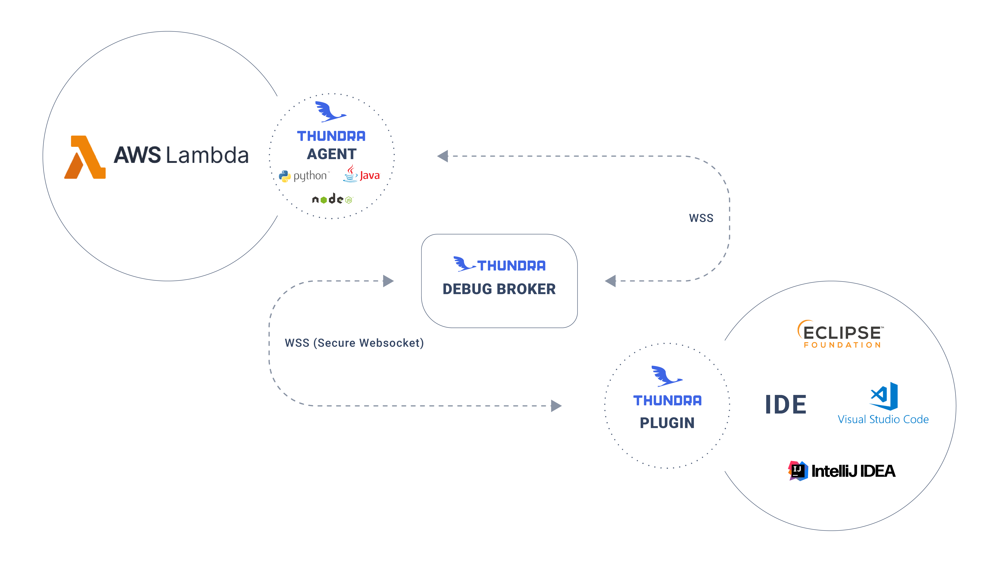

# AWS Lambda Debugger


This page is deprecated. You can check the active version from [here](https://docs.serverlessdebugger.com/).


Since its inception, serverless has had a large problem: being able to perform native debugging. Abstracting away the cloud platform freed up time for developers to manage the runtime environment, but it also took away the opportunity to debug applications from their IDE.

There have been many attempts to solve this problem, including simulating the cloud environment and mocking managed services. However, as you can imagine, these solutions lack two crucial capabilities:

* Security permissions of AWS Lambda functions
* Authenticity of event data flowing between resources

By providing online debugging support, Thundra removes the barriers that prevent the ability to debug AWS Lambda functions on IDE. Thundra's solution sets up a secure bridge between the AWS Lambda environment and your debugger on IDE via a web socket communication. This allows you to debug your applications like you could debug any code that you host on your computer with native debugging actions, enabling you to see the values of local variables and the entire stack trace.

As can be seen in the image below, we set up a secure bridge to exchange data between the AWS Lambda environment and the IDE. The bridge encrypts the data while exchanging it between several nodes.


By default, Thundra’s online debugger works on our own broker hosted by Thundra. If you prefer to host the debugger on your own account, we also provide a self-hosted solution. Learn more about this option [here](self-hosted-broker.md).&#x20;



Don't forget to increase the timeout value of your AWS Lambda function if you need more time than the set default.


All you need to do to get started using this tool is to plug the Thundra libraries into your Lambda functions for [Node.js](../../node.js/online-debugging.md), [TypeScript](../../node.js/online-debugging.md#using-the-online-debugging-with-node-js-lambda-functions), [Python](../../python/online-debugging.md), and [Java](../../java/online-debugging.md) and start debugging on [VSCode](../../ide-integrations/vscode-plugin/) or [IntelliJ IDEA](../../ide-integrations/intellij-plugin.md).&#x20;

