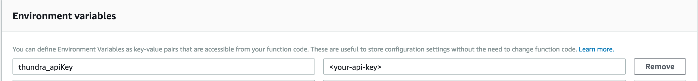

# Integration Options for Node.js SDK



### Using Layers

Integrating Thundra using AWS Lambda Layers is the recommended (and easier) way to get started with Thundra. Depending on whether or not you choose to use a custom runtime, you can integrate Thundra with no code changes at all or just by wrapping your handler function.

#### **Step 1: Deploy Your Function to AWS Lambda**

Bundle all your Node.js Lambda function files and any additional required packages, and then upload it to the AWS Lambda console using the “Upload a.zip file” option for the code entry type. Note that Thundra dependencies are not expected to be in the artifact to be uploaded, as they come with a layer that will be utilized at a later point.

#### **Step 2: Configure Your Function**

Add Thundra's Node.js layer to your Lambda function using the ARN below. Note that the ARN contains a region and a version parameter which you will need to set. Set the region value to your Lambda function's region and the version value to the layer version you want to use with your Lambda function.


```
arn:aws:lambda:${region}:269863060030:layer:thundra-lambda-node-layer:${version}
```



Latest version of the Thundra's Node.js layer: 



After the Thundra layer ARN has been added, you can continue using a custom runtime or continue without using a custom runtime. Regardless of what you choose, make sure to also set the `THUNDRA_APIKEY` environment variable to the API key you get from the Thundra console.



#### Step 3: Configure Handler

####


You should only use **one** (either auto or manual) of the options below, not both of them!


#### a. Auto wrap

Set the handler to `thundra_handler.wrapper` and then set the `THUNDRA_AGENT_LAMBDA_HANDLER` environment variable value to your original handler (e.g., `index.handler`).

#### b. Manual wrap

You can wrap your Lambda handler to integrate Thundra as shown below.


```javascript
const thundra = require("@thundra/core")();

exports.handler = thundra((event, context,callback) => {
    callback(null, "Hello Thundra!");
});

```



In the example above, the required **`@thundra/core`** package is already available in Thundra's Node.js layer, which we already added. Thus, you don't need to install the package and bundle it with your Lambda function.


#### Step 4: Invoke Your Function

Now you can try to invoke your Lambda function and see the details of your invocation in the Thundra console!



### Without L**ayers**

If you do not want to use AWS Lambda Layers, you can still easily integrate Thundra to your Node.js Lambda function. All you have to do is install the `@thundra/core` package via `npm`.

#### Step 1: Install the @thundra/core package

```bash
npm install @thundra/core --save
```

#### Step 2: Wrap your Lambda Handler

After installing the `@thundra/core` module, you will need to wrap your Lambda handlers. Thundra will monitor your AWS Lambda function automatically, supporting `callback` along with various `context` functions.


```javascript
const thundra = require("@thundra/core")();

exports.handler = thundra((event, context,callback) => {
    callback(null, "Hello Thundra!");
});
```


#### Step 3: **Deploy Your Function to AWS Lambda**

Bundle your function and any additional required Node.js packages, and then upload it to the AWS Lambda console using the “**Upload a.zip file**” option for the code entry type.

#### Step 4: Configure your function

In the AWS Lambda console, set the `THUNDRA_APIKEY` environment variable to the API key value you got from the Thundra console.


#### Step 5: Invoke your function!

Now you can try to invoke your Lambda function and see the details of your invocation in the Thundra console!



### **Serverless Framework**

#### **Step 1: Install Thundra’s Serverless Plugin to Automatically Wrap Your Functions**

```bash
npm install serverless-plugin-thundra
```

#### **Step 2: Adding Thundra's Serverless Plugin in `serverless.yml` File**

After installing Thundra’s serverless plugin, specify it as a plugin for your serverless environment by adding it under the plugins section of your serverless.yml file.


```yaml
plugins:  
    - serverless-plugin-thundra
```


**Step 3: Add `THUNDRA_APIKEY` to Environment Variables Under `provider` Section in `serverless.yml` **&#x20;


```yaml
provider: 
    environment:
        THUNDRA_APIKEY: <YOUR-THUNDRA-API-KEY>
```


**Step 4: Deploy**


```bash
serverless deploy
```


#### Step 5: Invoke your function!

Now you can try to invoke your Lambda function and see the details of your invocation in the Thundra console!



#### **Step 1: Get the Thundra Layer ARN**


```
arn:aws:lambda:${region}:269863060030:layer:thundra-lambda-node-layer:${version}
```



Latest version of the Thundra's Node.js layer: 



#### **Step 2: Construct Thundra Layer**

With the Thundra layer ARN (using latest layer version is highly recommended), you can use the layer construct in your CDK code.

```typescript
import { LayerVersion } from "@aws-cdk/aws-lambda";
const thundraLayer = LayerVersion.fromLayerVersionArn(this, "ThundraLayer", "<ARN>");
```


#### **Step 3: Configure Lambda Function**

You can then set it for all the functions in your stack using the [`addDefaultFunctionLayers`](https://docs.serverless-stack.com/constructs/Stack#adddefaultfunctionlayers) and [`addDefaultFunctionEnv`](https://docs.serverless-stack.com/constructs/Stack#adddefaultfunctionenv). Note we only want to enable this when the function is deployed, not in [Live Lambda Dev](https://docs.serverless-stack.com/live-lambda-development) as the layer will prevent the debugger from connecting.

```typescript
if (!scope.local) {
  const thundraAWSAccountNo = 269863060030;
  const thundraNodeLayerVersion = 96; // Latest version at time of writing
  const thundraLayer = LayerVersion.fromLayerVersionArn(
    this,
    "ThundraLayer",
    `arn:aws:lambda:${scope.region}:${thundraAWSAccountNo}:layer:thundra-lambda-node-layer:${thundraNodeLayerVersion}`,
  );
  this.addDefaultFunctionLayers([thundraLayer]);
  
  this.addDefaultFunctionEnv({
    THUNDRA_APIKEY: process.env.THUNDRA_API_KEY,
    NODE_OPTIONS: "-r @thundra/core/dist/bootstrap/lambda",
  });
}
```



### AWS SAM

#### **Step 1: Add configuration changes on SAM `template.yml`**

* Add the `THUNDRA_APIKEY` environment variable using your Thundra API key.

```yaml
Globals:
  Function:
    Environment:
      Variables:
          THUNDRA_APIKEY: <YOUR-THUNDRA-API-KEY>
```

* Add the Thundra layer to `Layers` in the `Globals` section. The `ThundraAWSAccountNo` and `ThundraNodeLayerVersion` parameters are defined in the Parameters section in the following configuration:


Latest version of the Thundra's Node.js layer: 


```yaml
Parameters:
  ThundraAWSAccountNo:
    Type: Number
    Default: 269863060030

  ThundraNodeLayerVersion:
    Type: Number
    Default: 96 # Or use any other version

Globals:
  Function:
    Layers:
      - !Sub arn:aws:lambda:${AWS::Region}:${ThundraAWSAccountNo}:layer:thundra-lambda-node-layer:${ThundraNodeLayerVersion}
      …

```

* Change `Handler` to Thundra handler

```yaml
Resources:
  HelloWorldFunction:
    Type: AWS::Serverless::Function
    Properties:
      Handler: thundra_handler.wrapper
```

* Pass your handler to Thundra over `THUNDRA_AGENT_LAMBDA_HANDLER` environment variable

```yaml
Resources:
  HelloWorldFunction:
    Type: AWS::Serverless::Function
    Properties:
      Handler: thundra_handler.wrapper
      Environment:
        Variables:
          THUNDRA_AGENT_LAMBDA_HANDLER: <YOUR-LAMBDA-HANDLER>
```

An example configuration:

```yaml
Parameters:
  ThundraAWSAccountNo:
    Type: Number
    Default: 269863060030
  ThundraNodeLayerVersion:
    Type: Number
    Default: 96 # Or use any other version

Globals:
  Function:
    Timeout: 5
    Environment:
      Variables:
        THUNDRA_APIKEY: <YOUR-THUNDRA-API-KEY>
    Layers:
      - !Sub arn:aws:lambda:${AWS::Region}:${ThundraAWSAccountNo}:layer:thundra-lambda-node-layer:${ThundraNodeLayerVersion}

Resources:
  HelloWorldFunction:
    Type: AWS::Serverless::Function
    Properties:
      Handler: thundra_handler.wrapper
      Environment:
        Variables:
          THUNDRA_AGENT_LAMBDA_HANDLER: <YOUR-LAMBDA-HANDLER>

```

**Step 2: Test / Deploy**

To build and run your function locally, use the following:

```bash
sam build && sam local invoke
```

Then, package and deploy your function using `sam`.

#### Step 2: Invoke your function!

Now you can try to invoke your Lambda function and see the details of your invocation in the Thundra console!



### AWS CDK

#### **Step 1: Apply Configuration Changes on Your Function Properties.**

* Add `THUNDRA_APIKEY` environment variable with your Thundra API key.&#x20;

```typescript
import {Function} from "@aws-cdk/aws-lambda";

export class YourConstructClass extends core.Construct {

  const thundraApiKey = <YOUR-THUNDRA-API-KEY>;

  constructor(scope: core.Construct, id: string) {
    const yourFunction = new Function(this, "<YOUR-LAMBDA-HANDLER>", {
        ..., // other function properties
        environment: {
          ..., // other environment variables
          THUNDRA_APIKEY: thundraApiKey
        } 
    });
  }
}
```

* Define Thundra layer and add it to your function properties.&#x20;
* And change your handler to Thundra's handler as described below.


Latest version of the Thundra's Node.js layer: 



```typescript
import {Aws} from "@aws-cdk/core";
import {Function, LayerVersion} from "@aws-cdk/aws-lambda";

export class YourConstructClass extends core.Construct {
  
  const thundraApiKey = <YOUR-THUNDRA-API-KEY>;
  const thundraAWSAccountNo = 269863060030;
  const thundraNodeLayerVersion = 96; // or any other version 
  const thundraLayer = LayerVersion.fromLayerVersionArn(
    this,
    "ThundraLayer",
    `arn:aws:lambda:${Aws.REGION}:${thundraAWSAccountNo}:layer:thundra-lambda-node-layer:${thundraNodeLayerVersion}`
  );
      
  constructor(scope: core.Construct, id: string) {
    const yourFunction = new Function(<scope>, <id>, {
        ..., // other function properties
        // Set your main handler to Thundra's handler
        handler: "thundra_handler.wrapper",
        environment: {
          ..., // other environment variables
          THUNDRA_APIKEY: thundraApiKey,
          // Add your handler as an environment variable
          // for Thundra to call as the original handler
          THUNDRA_AGENT_LAMBDA_HANDLER: "<YOUR-LAMBDA-HANDLER>",
        },
        layers: [
          thundraLayer,
          ... // other layers
        ] 
    });
  }
}
```



`Aws.REGION` is a pseudo parameter that is bootstrapped from your stack's environment configuration



An example configuration:

```typescript
import {Aws} from "@aws-cdk/core";
import {Code, Function, Runtime, LayerVersion} from "@aws-cdk/aws-lambda";

export class YourConstructClass extends core.Construct {
  
  const thundraApiKey = <YOUR-THUNDRA-API-KEY>;
  const thundraAWSAccountNo = 269863060030;
  const thundraNodeLayerVersion = 96; // or any other version 
  const thundraLayer = LayerVersion.fromLayerVersionArn(
    this,
    "ThundraLayer",
    `arn:aws:lambda:${Aws.REGION}:${thundraAWSAccountNo}:layer:thundra-lambda-node-layer:${thundraNodeLayerVersion}`
  );
      
  constructor(scope: core.Construct, id: string) {
    const handler = new Function(this, "MyFunction", {
      runtime: Runtime.NODEJS_14_X,
      code: Code.asset("/path/to/your/resource"),
      handler: "thundra_handler.wrapper",
      environment: {
        THUNDRA_APIKEY: thundraApiKey,
        THUNDRA_AGENT_LAMBDA_HANDLER: "<YOUR-LAMBDA-HANDLER>",
      },
      layers: [
        thundraLayer
      ]
    });
  }
}
```

#### **Step 2: Build / Deploy**

```bash
npm run build && cdk deploy
```

#### Step 3: Invoke Your Function

Now you can try to invoke your Lambda function and see the details of your invocation in the Thundra console!



