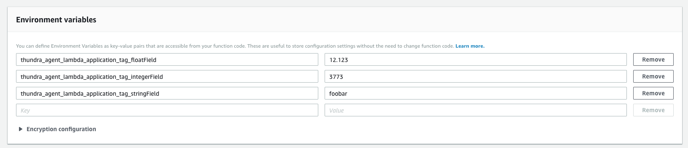

# Tagging in Python SDK

With Thundra's Python agent, you can add custom tags to your invocations or applications, which will help you better filter the data. Invocation tags are added only to the Invocation data type; application tags are global and are automatically added to `Invocation`, `Metric`, `Trace`, `Span`, and `Log` data.

## Adding Invocation Tags

You can add custom tags to your invocation with methods in the `invocation_support` module. The functions that can be used in the module are shown below:


```python
get_tag(key)
"""
    Parameters
    ----------
    key : string

    Returns
    -------
    object
"""

get_tags(key)
"""
    Parameters
    ----------
    key : string

    Returns
    -------
    object
"""

set_tag(key, value)
"""
    Parameters
    ----------
    key : string
    value : object
"""

set_many(tags)
"""
    Parameters
    ----------
    tags : dict 
"""

remove_tag(key)
"""
    Parameters
    ----------
    key : string
"""

set_error(err)
"""
    Parameters
    ----------
    err : object
"""
```


The example below shows how to tag a Lambda invocation (e.g., Lambda Handler) :


```python
from thundra.thundra_agent import Thundra
import thundra.plugins.invocation.invocation_support as invocation_support

thundra = Thundra()

@thundra
def handler(event, context):
    invocation_support.set_tag("string", "thundra")
    invocation_support.set_tag("number", 5)
    invocation_support.set_tag("object", {"id": 5})

    print(invocation_support.get_tags())
```


## Adding Application Tags

You can add application tags via environment variables. All application tags which start with `thundra_agent_lambda_application_tag_` are parsed by Thundra's Python agent. The text after the `thundra_agent_lambda_application_tag_` prefix is used as the key of the tag, and the value of the environment variable becomes the value of the tag. For example, `thundra_agent_lambda_application_tag_floatField` with the value 12.123 will add an application tag to all data with the key floatField and the value 12.123.

The example below shows how to add application tags with various data types to a Lambda invocation:



