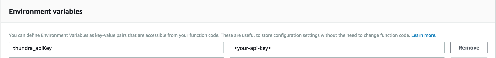

# Integration Options for Python SDK



### Using Layers

#### **Step 1: Deploy Your Function to AWS Lambda**&#x20;

Bundle all your Python module files and any additional required Python libraries, and then upload it to the AWS Lambda console using the “Upload a.zip file” option for the code entry type. Note that Thundra dependencies are not expected to be in the artifact to be uploaded, as they come with a layer that will be utilized at a later point

#### **Step 2: Configure Your Function**

Add the API key to the environment variables on the Amazon Lambda console.



**Add Thundra layer**

Next, add the Thundra layer by clicking on the Layers option in the Designer tab on your Lambda function console. Then select the “Add Layer” button and add the Thundra layer's ARN.

```
arn:aws:lambda:${region}:269863060030:layer:thundra-lambda-python-layer:${latest-version} 
```



Note that the region of the ARN is dynamic, so you need to change it accordingly to the region where you deploy your function. So let’s say that you deploy your Lambda function to the Oregon (`us-west-2`) region. The layer ARN will be:`arn:aws:lambda:us-west-2:269863060030:layer:thundra-lambda-python-layer:${layer-version}`


**Configure handler**

Set the handler to `thundra.handler.wrapper`. Set the `thundra_agent_lambda_handler` environment variable value to your original handler (e.g., `handler.handle`).

**Step 3: Invoke your deployed function by clicking on the Test button on the top right**

Clicking on the “Test” button, which is located on the top right side of the AWS console, will result in an invocation of your function (after you have configured test data per the specifications of your function).

**Step 4: Monitor your function with Thundra**\
\
After generating your first invocation, the “Next” button will appear in the Invocation Monitor bar. Simply click the button to see monitoring data from your invocation.\




### Without L**ayers**

#### **Step 1: Install Thundra’s python package**

In the project directory, run the following command:

```bash
pip3 install thundra -t .
```

#### **Step 2: Deploy Your Function to AWS Lambda.**

Bundle all your Python module files and any additional required Python libraries, and then upload it to the AWS Lambda console using the “Upload a.zip file” option for the code entry type.

#### **Step 3: Configure Your Function**

Add the API key to the environment variables on the Amazon Lambda console.


**Configure Handler**

Set the handler to thundra.handler.wrapper. Set the thundra\_agent\_lambda\_handler environment variable value to your handler.

#### **Step 4: Invoke Your Deployed Function**

Clicking on the “Test” button, which is located on the top right side of the AWS console, will result in an invocation of your function (after you have configured test data per the specifications of your function).

#### **Step 5: Monitor Your Function with Thundra**

After generating your first invocation, the “Next” button will appear in the Invocation Monitor bar. Simply click the button to see monitoring data from your invocation.



### **Serverless Framework**

#### **Step 1: Install Thundra’s Serverless Plugin to Automatically Wrap Your Functions**

```bash
npm install serverless-plugin-thundra
```

#### **Step 2: Add Thundra's Serverless Plugin in serverless.yml File**&#x20;

After installing Thundra’s serverless plugin, specify it as a plugin for your serverless environment by adding it under the plugins section of your serverless.yml file.


```yaml
plugins:  
    - serverless-plugin-thundra
```


#### **Step 3: Add `thundra` component to custom**

Add the `thundra` component under custom with apiKey under that, as seen below:


```yaml
custom:
    thundra:
        apiKey: <YOUR THUNDRA API KEY>
```


**Step 4: Add the `thundra_apiKey` to Environment Variables under the Provider Section in serverless.yml**


```yaml
provider: 
    environment:
        thundra_apiKey: <YOUR THUNDRA API KEY>
```


#### **Step 5: Deploy and Test app**&#x20;


```bash
serverless deploy
serverless invoke --function functionName
```


#### **Step 6: Monitor Your Function with Thundra**

After generating your first invocation, the “Next” button will appear in the Invocation Monitor bar. Simply click the button to see monitoring data from your invocation.



### AWS SAM

#### **Step 1: Add Configuration Changes on the SAM template.yml**

* Add the `thundra_apiKey` environment variable along with your Thundra API key.

```yaml
Globals:
  Function:
	...
    Environment:
      Variables:
          thundra_apiKey: <your_api_key>
```

* Add the Thundra layer to “Layers” in the Globals section. The `ThundraAWSAccountNo` and `ThundraPythonLayerVersion` parameters are defined in the Parameters section in the following configuration:


Latest layer version of thundra python layer: 



```yaml
  ThundraAWSAccountNo:
    Type: Number
    Default: 269863060030

  ThundraPythonLayerVersion:
    Type: Number
    Default: 12 # Or use any other version

Globals:
  	...
    Function:
      ...
      Layers:
          - !Sub arn:aws:lambda:${AWS::Region}:${ThundraAWSAccountNo}:layer:thundra-lambda-python-layer:${ThundraPythonLayerVersion}

	…

```

* Change the `handler` of functions to be wrapped to `thundra.handler.wrapper`. Alternatively, if you want to wrap all the functions in your SAM configuration file, you can set the handler in the `Globals` section.

```yaml
Globals:
  Function:
    ...

    Handler: thundra.handler.wrapper

```

* For each wrapped function, add the `thundra_agent_lambda_handler` environment variable with the value set to the handler path of your function.

```yaml
Resources:
  HelloWorldFunction1:
    Type: AWS::Serverless::Function
    Properties:
      Environment:
          Variables:
              thundra_agent_lambda_handler: hello_world_1.app.lambda_handler

```

An example configuration:

```yaml
Parameters:
  ThundraAWSAccountNo:
    Type: Number
    Default: 269863060030

  ThundraPythonLayerVersion:
    Type: Number
    Default: 11 # Or use any other version

Globals:
  Function:
    Runtime: python3.7
    Timeout: 5

    Handler: thundra.handler.wrapper
    Layers:
        - !Sub arn:aws:lambda:${AWS::Region}:${ThundraAWSAccountNo}:layer:thundra-lambda-python-layer:${ThundraPythonLayerVersion}

    Environment:
      Variables:
          thundra_apiKey: <your_api_key>

Resources:
  HelloWorldFunction1:
    Type: AWS::Serverless::Function
    Properties:
      Environment:
          Variables:
              thundra_agent_lambda_handler: hello_world_1.app.lambda_handler

```

#### **Step 2: Test the Application**&#x20;

To build and run your functions locally:

```bash
sam build && sam local invoke
```

#### **Step 3: Monitor Your Function with Thundra**

After generating your first invocation, the “Next” button will appear in the Invocation Monitor bar. Simply click the button to see monitoring data from your invocation.\
\




### AWS CDK

#### **Step 1: Apply Configuration Changes to Your Function Properties**

* Add the `thundra_apiKey` environment variable with your Thundra API key.

```python
from aws_cdk import (core,
                     aws_lambda as lambda_)

class YourConstructClass(core.Construct):

    def __init__(self, scope: core.Construct, id: str):
        super().__init__(scope, id)

        thundraApiKey = <your_api_key>
      
        handler = lambda_.Function(self, "YourHandler",
                           ..., # other function properties
                           environment=dict(
                               ..., # other environment variables
                               thundra_apiKey=thundraApiKey)
```

* Define the Thundra layer and add it to your function properties.


Latest layer version of thundra python layer:


```python
from aws_cdk import (core,
                     aws_lambda as lambda_)


class YourConstructClass(core.Construct):

    def __init__(self, scope: core.Construct, id: str):
        super().__init__(scope, id)

        thundraApiKey = <your_api_key>
        thundraAWSAccountNo = 269863060030
        thundraPythonLayerVersion = 31 # or any other version
        thundraPythonLayer = lambda_.LayerVersion.from_layer_version_arn(self, "ThundraLayer",
            "arn:aws:lambda:{}:{}:layer:thundra-lambda-python-layer:{}".format(
                core.Aws.REGION, thundraAWSAccountNo, thundraPythonLayerVersion)),
      
        handler = lambda_.Function(self, "YourHandler",
                           ..., # other function properties
                           environment=dict(
                               ..., # other environment variables
                               thundra_apiKey=thundraApiKey),
                           layers=[
                               thundraPythonLayer,
                               ... # other layers
                               ]
                           )
```


Aws.REGION is a pseudo parameter which is bootstrapped from your stack's environment configuration.


* Change the handler of your function to `thundra.handler.wrapper`, and add the environment variable `thundra_agent_lambda_handler` with your handler.

```python
from aws_cdk import (core,
                     aws_lambda as lambda_)

class YourConstructClass(core.Construct):

    def __init__(self, scope: core.Construct, id: str):
        super().__init__(scope, id)

        thundraApiKey = <your_api_key>
        thundraAWSAccountNo = 269863060030
        thundraPythonLayerVersion = 31 # or any other version
        thundraPythonLayer = lambda_.LayerVersion.from_layer_version_arn(self, "ThundraLayer",
            "arn:aws:lambda:{}:{}:layer:thundra-lambda-python-layer:{}".format(
                core.Aws.REGION, thundraAWSAccountNo, thundraPythonLayerVersion)),
      
        handler = lambda_.Function(self, "YourHandler",
                           ..., # other function properties
                           handler=thundra.handler.wrapper
                           environment=dict(
                               ..., # other environment variables
                               thundra_apiKey=thundraApiKey,
                               thundra_agent_lambda_handler=<your_handler>),
                           layers=[
                               thundraPythonLayer,
                               ... # other layers
                               ]
                           )
```

An example configuration:

```python
from aws_cdk import (core,
                     aws_lambda as lambda_)

class YourConstructClass(core.Construct):

    def __init__(self, scope: core.Construct, id: str):
        super().__init__(scope, id)

        thundraApiKey = <your_api_key>
        thundraAWSAccountNo = 269863060030
        thundraPythonLayerVersion = 31
        thundraPythonLayer = lambda_.LayerVersion.from_layer_version_arn(self, "ThundraLayer",
                             "arn:aws:lambda:{}:{}:layer:thundra-lambda-python-layer:{}".format(
                                 core.Aws.REGION, thundraAWSAccountNo,
                                 thundraPythonLayerVersion))
                                     
        with open("your-lambda-handler.py", encoding="utf8") as fp:
            handler_code = fp.read()
        
        handler = lambda_.Function(self, "YourHandler",
                               runtime=lambda_.Runtime.PYTHON_3_8,
                               code=lambda_.InlineCode(handler_code),
                               handler="thundra.handler.wrapper",
                               environment=dict(
                                   thundra_apiKey2=thundraApiKey,
                                   thundra_agent_lambda_handler="your.handler"),
                               layers=[
                                   thundraPythonLayer]
                               )
```

#### **Step 2: Build and Deploy**

```bash
cdk deploy
```

#### Step 3: Invoke Your Function!

Now you can invoke your Lambda function and see the details of your invocation in the Thundra console!



### AWS Lambda Docker Image

#### **Step 1: Apply Configuration Changes to Your Function Properties**

* Add the `thundra_apiKey` environment variable with your Thundra API key.

```
ENV THUNDRA_APIKEY = <your_Thundra_apikey>
```

* Configure handler

```
ENV THUNDRA_AGENT_LAMBDA_HANDLER=<your-lambda-handler>
```

#### ****

#### **Step 2: Installing Thundra**

&#x20;  ****   There are two options to install Thundra. One is using **** the `pip` command and another way is adding Thundra to your "requirements.txt".

* Installing via `pip`

```
RUN pip install thundra --target ${LAMBDA_TASK_ROOT}
```

* Adding Thundra to requirements.txt file

```
COPY requirements.txt ${LAMBDA_TASK_ROOT}
RUN pip3 install -r requirements.txt --target "${LAMBDA_TASK_ROOT}"
```

&#x20;     ****      `${LAMBDA_TASK_ROOT}` is `"/var/task"` where your handler should be located according to [AWS documentation](https://docs.aws.amazon.com/lambda/latest/dg/images-create.html). Check the **** "**To create an image from an AWS base image for Lambda**" section from the AWS documentation link.

#### ****

#### **Step 3: Adding Thundra to CMD**

* Change your Docker CMD. Please make sure your current `WORKDIR` is `${LAMBDA_TASK_ROOT}` in which both Thundra and your lambda handler are located.

```
CMD [ "thundra.handler.wrapper" ]
```

An example DockerFile:

```
FROM public.ecr.aws/lambda/python:3.8

# Copy function code. Handler is located under "app.py".
COPY app.py ${LAMBDA_TASK_ROOT}
ENV THUNDRA_APIKEY=<your_Thundra_apikey>
ENV THUNDRA_AGENT_LAMBDA_HANDLER="app.handler"

# installing Thundra in which your handler is.
RUN  pip3 install thundra --target ${LAMBDA_TASK_ROOT}

# Set the CMD to Thundra handler
CMD [ "thundra.handler.wrapper" ]
```

#### ****

#### **Step 4: Build your DockerFile**

```
docker build -t <image-name>
```

****

**Step 5: Locally test your  container image**

* Run your Lambda application locally

```
docker run -p 9000:8080 <image name>
```

Invoke your local application

```
curl -XPOST "http://localhost:9000/2015-03-31/functions/function/invocations" -d '{}'
```

You should see your function’s expected response as the output of this request. You can also see the invocation logs on the console you run the Docker image.

****

**Step 6: Push the container image to ECR and deploy it to your Lambda function**

Check the "**To create an image from an AWS base image for Lambda**" section under [AWS documentation](https://docs.aws.amazon.com/lambda/latest/dg/images-create.html).


