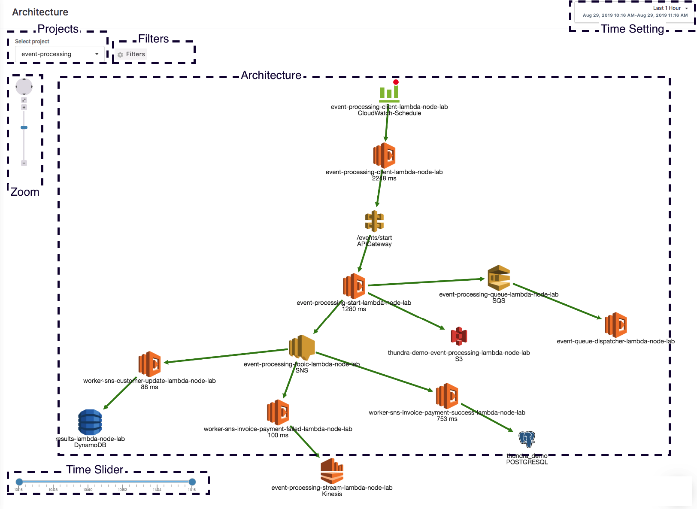

# Architecture Page

By its nature, serverless is distributed, which makes it hard to understand serverless architectures by only checking functions. That’s why seeing a visual display of your architecture can help you more easily discover errors in your serverless stack. Thundra can discover your architecture and show all interactions between your resources, such as DynamoDB, Redis, SQS, and your Lambda function.

.png>)

The Architecture page consists of the following sections:

* Projects
* Filters
* Zoom
* Architecture
* Time Slider
* Time Setting

### Projects

.png>)

Architectures are drawn according to your projects, so you need to select your project to view your serverless architecture.

### Filters

.png>)

You can customize your architecture view using filters. When you hover your mouse over the Filters button on the Architecture page, different filtering options will be displayed. These options include:

* Show Labels, which is selected by default, and shows labels on vertices. Specifically, for Lambda vertices, you can see the function name and the average duration of invocations.

.png>)

* _Show Metrics, which shows more information about the interaction between a Lambda function and other resources. If you don’t click on the edges, you can see the count and duration between your function and resources at a glance. When you click on the edges, you will see additional details._

.png>)

* _Old AWS Icons_ shows your serverless architecture with old icons. AWS announced new icons very recently, so to see the new icons in your architecture, you will need to uncheck this setting.

.png>)

* _Export PNG_ which exports your architecture image in png format.

### **Time Slider**

.png>)

The Time Slider helps you figure out changes in your architecture. For example, if you add a new function to your project, you can easily detect changes and compare it with previous architectures. You just need to change the focus to a specific period of time and play with the start and end time to see the effect of the change you made. New nodes and edges will appear/disappear and you will be able to track the change with the new features you introduced.

### **Architecture**

.png>)

You can click on the edges to get details about the interaction between vertices. Edges are colored as green, yellow, orange, and red, depending on the health of the interaction. Health is defined as the ratio of non-erroneous interactions over all interactions. An edge is:

* Green if health is more than 90%.
* Yellow if health is between 70% and 90%.
* Orange if health is between 50% and 70%.
* Red if health is less than 50%.

.png>)

You can see detailed information about an interaction between two resources by clicking on the edge between them. When you click on edges, a panel showing the details of the interaction is opened on the right side of the screen, and the edge turns gray. The detail panel has the following items:

* The summary section, which gives quick info about the interaction.
* The count chart, which shows the trend and spikes in the interaction in terms of frequency.
* The duration chart, which shows the trend and spikes in the interaction in terms of average, 95th, and 99th percentile.
* The invocation table, which lists every single invocation involved with the selected interaction.

.png>)

#### Summary

.png>)

In the summary section, some superficial details about the interaction between your Lambda function and resource are given. You can also compare those metrics with the previous period in terms of percentage.

* Invocation Count is the number of interactions that occurred between the function and the resource.
* Error displays the number of erroneous interactions that occurred between the function and the resource.
* Avg Duration shows the average duration of interactions that occurred between the function and the resource.
* 99th Duration shows the 99th percentile duration of interactions that occurred between the function and the resource.
* Health is the ratio of healthy interactions to all interactions that occurred between the function and the resource.

#### Count & Duration Charts

.png>)

`The count chart`visualizes healthy and erroneous interactions between your function and resource. For example, if your function makes some calls to the DynamoDB table and the interaction somehow fails due to throttles or outages, you will be able to see those interactions with this graph.&#x20;

`The duration chart` helps you see the average, p95, and p99 durations between your function and resource.

#### Invocation List

.png>)

`The Invocation List` contains the start time of your invocation, its duration, and the duration of interactions between your function and resource. Invocations are listed in descending order of durations.

