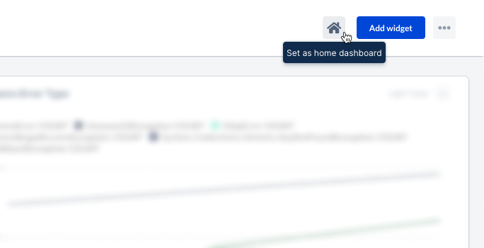
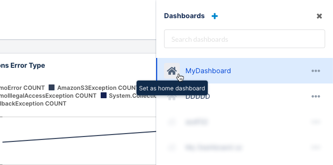
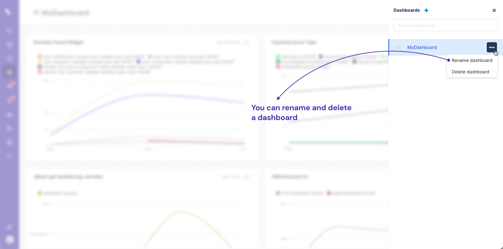
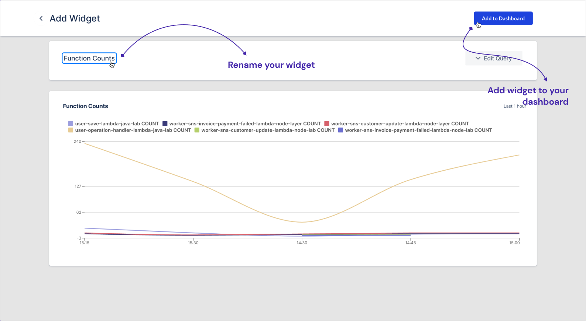
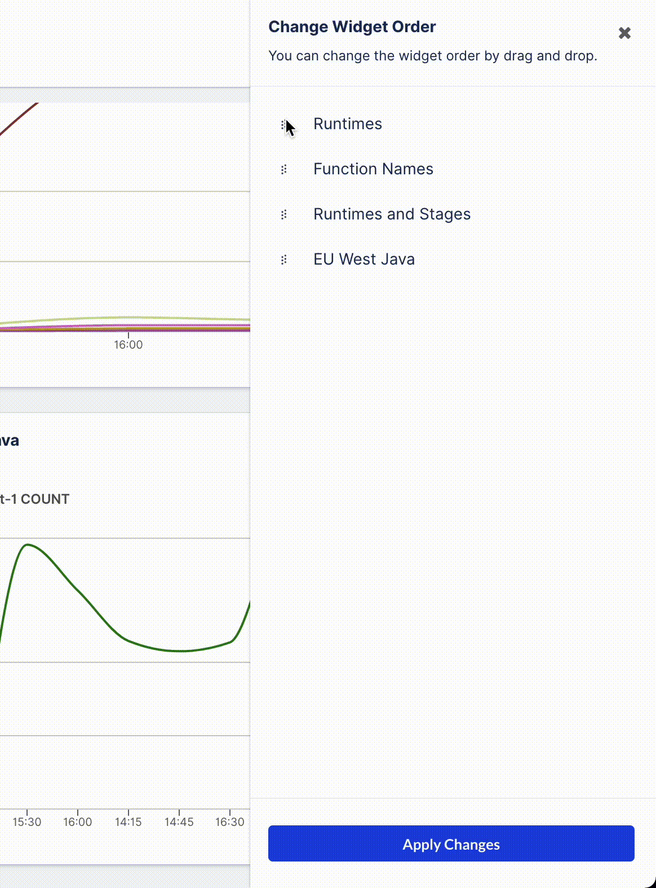

# Custom Dashboard Page

Thundra APM's custom dashboard helps you to envision your data performance metrics. Custom dashboards can be used to monitor your functions, applications and API's. By using custom dashboards you can gather and visualize the specific data you want to see, the way you want to see it.

## Dashboards

Dashboards are used to organize relevant widgets in the same organization to review all of the analytics your team needs at a birds-eye view. You can create dashboards and [add widgets](custom-dashboard-page.md#adding-a-widget) into them.

### Creating a Dashboard

There are two ways to create a dashboard of your own. The first way is to click the **Create dashboard** button from the Dashboards tab. This will only appear when you don't have any dashboard.

The second way is to click on the "..." icon on the top right and select "Create a dashboard" from the context menu.

You’ll be prompted to Create Dashboard modal. You need to name your new dashboard and click the **Save** button.

Limits for dashboard creation:

* **Free:** 1&#x20;
* **Lite:** 3&#x20;
* **Standard:** Unlimited&#x20;

After you create a dashboard, you can [add widgets](custom-dashboard-page.md#adding-a-widget) into your dashboard

### Setting a home dashboard

You can set the one dashboard you view frequently as home dashboard to make it easier to view them all in one place. Home dashboards will always appear when you click Dashboard on the navigation.

You can set a dashboard as home in two ways. First you can click on the home icon on the top bar after you select a dashboard.

Second way is clicking on the home icon on the dashboard list. To open the dashboard list you need to click "View all dashboards" after you click "..." icon on the top right corner of the page.

### Renaming and deleting a dashboard

You can rename and delete any dashboard. Be careful that, if you delete a dashboard you will lost all your added widgets related to that dashboard.&#x20;

## Widgets

With the widgets, you can run queries of your data to create custom charts and other visualizations to add to your dashboards to create a birds-eye view of your most important metrics.

### Adding a widget

Imagine you want to measure the total COUNT of the functions invocation grouped by the function names. Widget builder helps you to analyze this measurement easily.

First click on the "Add widget" button on the top right corner of your dashboard. You will be directed to widget builder. Fill the necessary fields and Click on the **"Run Query"**

The preview of your widget will be shown under the query builder card. You can rename your widget by clicking on the Widget title area. If you are happy with the result, then you can add the  widget to your dashboard by clicking the "Add to Dashboard" button on the top right.

### Editing a widget

Once you click on the "..." icon on a widget, a context menu will be prompted. If you click on the "Edit widget", you will see your existing query on the next screen.

You can edit your widget query. Don't forget to click **"Run query"** after you change your query. Then when you click **"Save changes"** your widget will be updated successfully.&#x20;

### Changing a widget order

You can change the widget orders as you wish. In order to open widget ordering panel, click on the "..." icon on the top right of your dashboard page. Then select **"Change widget order"**. Order your widgets by dragging and dropping and click on the **"Apply changes"**

### Deleting a widget

In order to delete a widget, you need to click on the "..." icon on a widget, then a context menu will be prompted. If you click on the "Delete widget", your widget will be deleted. Deleting action is irreversible. Be aware that you will lose your widget.

&#x20;
