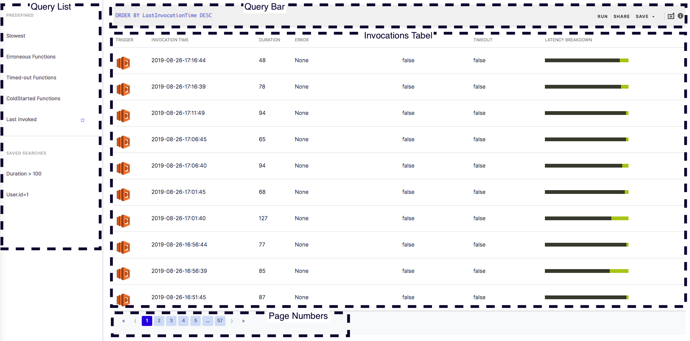

# Invocation Tab

The Invocations tab allows you to access every individual invocation executed by the function being analyzed. It lists all the invocations in a table, which can be filtered via querying. You can submit a query for invocations using the Query Bar or the [Query Helper,](../query-helper/query-helper-for-invocations.md) and also save your built queries in the Query List, located on the left side of the Invocations tab.

You can navigate to the Invocations tab by accessing the [Functions List](../functions-list-page/) page via the console navigator bar on the right side of the console. You can then select a function to analyze from the list displayed, and go to the [Function Details](./) page, where you can select Invocations from the tab view.

.png>)

Invocation tab consists of following parts:

* [Query List](invocation-tab.md#query-list)
* [Query Bar](invocation-tab.md#query-bar)
* [Invocation Table](invocation-tab.md#invocations-table)

### Query List

The Query List component, located on the left side of the invocations, lists all defined queries that you can use to filter through the displayed list of invocations. It can be split into two sections: **Predefined** queries and **Saved Searches**.

The **Predefined** section lists all queries that are created for you by Thundra to provide you quick access and filtering capabilities. Included predefined queries are:

* Last Invoked - sorts functions according to when they were last invoked
* Slowest - sorts functions according to their descending duration
* Erroneous - filters erroneous invocations and sorts them according to their invocation time, from the most recent to the oldest
* Timed-out - filters invocations that have timed-out, and sorts them according to their invocation time, from the most recent to the oldest
* Cold Started - filters invocations that have cold started, and sorts them according to their invocation time, from the most recent to the oldest

The **Saved Searches** section lists queries that you would like to save after entering and saving them in the Query Bar.

To use a query in the Queries List, simply select a query and the function listed will be filtered and ordered according to the query. Moreover, by clicking or hovering your mouse over a query, you will see two buttons appear to the right of the query. This allows you to either delete the selected query or set it as the default query, which will automatically filter your functions whenever you visit your Thundra console.

You can save these queries as Saved Search or Alert Policy. When you want to save them as Saved Search, the dialog will ask for the name and permissions of the system. When you want to save them as alert policy, a new dialog will open to configure your alert policy. That process is explained in detail [here](../alerts-page/creating-editing-alert-policies.md).\


#### Query Save Details

You can save your queries as public if your role is set as `Admin` or `Account Owner`, so that everyone in the organization can see the saved query. You can still save your queries as private so that only you can see them. If your role is set as `User` or `Developer`, you can only save the query for yourself, which means your query won't be visible to the whole organization.



#### Saving Queries as Alert Policies

If your role in the organization is set as `Admin`, `Account Owner`, or `Developer`, you can save queries as alert policies. The dropdown menu is not visible to the `User` role.


### &#x20;Query Bar

The Query Bar section located on top of invocations allows you to write custom queries to filter through your invocations. There are three buttons at the end of the Query Bar which allow you to `run`, `share`, and `save` the written query respectively.

The “Run” button will execute whatever query is in the bar.The “Save” button will open up a dialog to save your query as `Saved Search` or `Alert Policy`. When you want to save it as Saved Search, the dialog asks for the name and permissions of the system. When you want to save it as an alert policy, a new dialog will open to configure your alert policy. The process is explained in detail here.


#### Query Save Details

You can save your queries as public if your role is set as `Admin` or `Account Owner` so that everyone in the organization can see the saved query. You can still save your queries as private so that only you can see them. If your role is set as `User` or `Developer`, you can only save the query for yourself, which means your query won't be visible to the whole organization.



#### Saving Queries as Alert Policies

If your role in the organization is `Admin` or `Account Owner` or `Developer`, you can save queries as alert policies. The dropdown menu is not visible to the `User` role.


### Invocations Table

For a specific function, all invocations are listed in the Invocations Table. Invocations are listed based on the query entered in the Query Bar or selected from the Query List. Invocations are listed in terms of:

* Trigger - What triggered the function to be executed (i.e., another function, DynamoDB, or any other trigger)
* Invocation Time - The time the function was invoked and the specific invocation received
* Duration - How long it took for the Lambda function to be executed, in ms
* Error - Whether or not there was an error in executing the function, and if so, what kind of error it was
* Cold Start - Whether or not the specific invocation resulted in a cold start
* Timeout - Whether or not the invocation resulted in a time out
* Latency Breakdown - This is one of Thundra’s statistical illustrations, which allows you to get an insight into how your Lambda function behaved in that specific invocation. The Latency Breakdown bar represents your total invocation, and the subparts of the bar represent the various services and functions that were executed and interacted with each other during the invocation. Hence, you can see which integration or part of your Lambda function actually takes up which part of the invocation. When you hover your mouse over a part of this bar, a popover will be shown.

.png>)

You can show/hide columns in the Invocations Table.\

.png>)

You can display custom tags that you configure for your application/function as column. Scroll down to customize columns to see your tags.

When you click on an invocation, the [Invocations Detail](../invocation-detail-page/) page allows you to see trace data, logs, and other details for a specific invocation.
