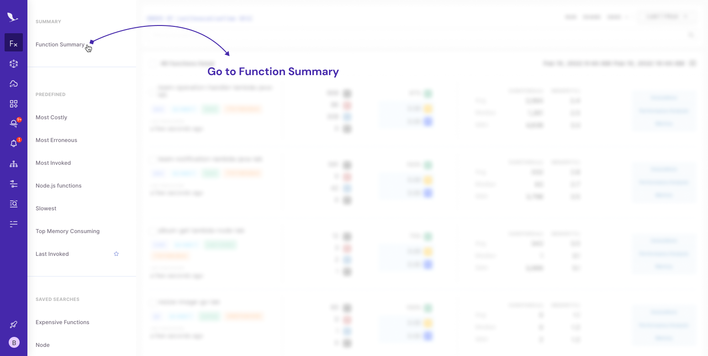

# Functions Summary

Function Summary page gives you a summarized view of a project’s Lambda functions at a glance. The display of metrics and performance information on the Dashboard page allows you to observe and monitor the health of your serverless system. You can easily detect problems in Lambda functions with anomaly detection for invocations, error counts, and duration of functions.

The Dashboard page includes the following sections:

* Statistics
* Alerts & Insights
* Lists of Functions
* Charts with Anomalies

### Statistics

In the Statistics section, general metrics about Lambda functions are displayed. These metrics are calculated according to the selected project and time range. The following metrics are displayed in Statistics:

* **Invocation Count -** Total invocation count of all Lambda functions in a selected project within a selected time range.
* **Error Count -** Total error count in invocations for a selected project within a selected time range.
* **Cold Start Count -** Total number of cold starts of invocations in a selected project within a selected time range.
* **Timeout Count -** Total number of timeouts of invocations in a selected project within a selected time range.
* **Total Cost -** Overall cost of functions in a selected project within a selected time range.
* Health - Overall health of stack for a selected project within a selected time range.

### Alerts & Insights

The Alerts and Insights section gives you an overview of your serverless stack. If you have any created alert policies on Thundra and some of them are violating, you can display them here.

Thundra also gives users insights to discover potential problems in their system. Users can display insights for the following issues:

* If there is more than a 50% jump in invocation count of a function compared with the previous period
* If any function reaches its timeout limit of 90% within a selected period
* If any function reaches its memory limit of 90% within a selected period
* If there is more than a 50% jump in the duration of a function compared with the previous period

Users can click on an insight to display details of that function for a selected time range.\

### Charts with Anomalies

.png>)

Two different charts are displayed on Dashboard page to illustrate invocation, error and duration metrics of your functions. Also, Thundra provides you to observe anomalies on your serverless stack using these charts. Details of how to use this feature explained below.

#### Anomaly Detection

Two different charts are displayed on the Dashboard page to illustrate the invocation, error, and duration metrics of your functions. You can observe anomalies on your serverless stack using these charts. Details of how to use this feature are provided below.

.png>)

To enable/disable anomaly detection on the invocation and error count chart, click on the “Anomaly” button.

.png>)

You can select two parameters to find patterns and detect anomalies using the “Gear” button located at the right corner of the chart section. These selections will affect both charts and include:

* **Period -** Time range of a recurring pattern of data.
* **Rollup -** Time interval to aggregate data points to one point. If you set rollup to 5 minutes, all data during that time will be displayed as one data point.

.png>)

The image above is a chart with anomalies. The gray area represents the normal pattern of your data. If any data point has value below or above this pattern, it will be displayed as red. When you hover on data points, you can display the boundaries of the normal pattern and value of anomaly data.

#### Invocation and Error Count&#x20;

.png>)

Invocation, error, and cold start count changes within a selected time range are visualized in the graph above. You can select which metrics will be displayed on the chart using the buttons above. At least one of the metrics should be selected. If anomaly detection is on and any anomalies are detected, they will be displayed with red points. The following statistics are displayed when you hover your mouse over the chart:

* Invocation count
* Error count
* Cold start count

.png>)

If the anomaly selection is on, the following values will be displayed when you hover your mouse over the chart:

* **Anomaly bound -** Boundary values (min-max) for normal instances
* **Anomaly detected -** Value of detected anomaly

You can select a function from the left table to display its error and invocation counts on the chart. Click on the function name at the top of the chart to navigate to its details.

#### Invocation Duration

.png>)

The following data is displayed when you hover your mouse over the invocation duration chart (shown above):

* **Average duration expected -** This will be displayed if the anomaly selection is enabled.
* **Average duration anomaly -** This refers to the average duration outside of normal patterns, which will be displayed if the anomaly selection is enabled.
* **Average duration -** This is the expected and calculated average duration of the invocation.

### List of Functions

.png>)

To give insight about functions in a user's stack, two different function lists are displayed on the Dashboard page:

* **Most costly functions -** This lists functions that have the most cost (see the image above).
* **Most problematic functions -** This lists functions with the worst health. Metrics such as error count and timeout count affect the health of a function.

.png>)

****

.png>)

If you want to have a deeper insight into a function, click on its name at the top of the chart. The charts displayed on the right-hand side will be re-drawn according to the function you select. Using this feature, you can easily observe the metrics and anomalies of your function. To display charts for all functions in a project, click on the “Close” icon located at the right corner of the screen.
