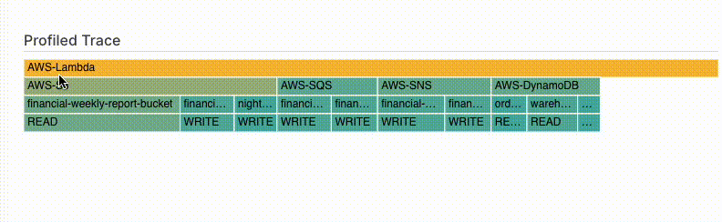

# Resource Usage Tab

Resource usage metrics provide performance details about the resources of a profiled invocation. Thundra APM provides this analysis within both flame graph and resource usage table.

#### What is a profiled invocation?

Profiled invocation represents the outline form of a traced invocation which includes detailed span data; whereas profiled invocation consists of the essential information about your invocation. Thundra agent collects that information to visualize and analyze your resource usage as shown below. &#x20;

.PNG>)

#### Using Profile Trace Graph

You can click on the resource you would like to deep dive into and see the related resource usages. When you hover on the resource, you can see how much time that resource takes in total, on the bottom of the graph.

