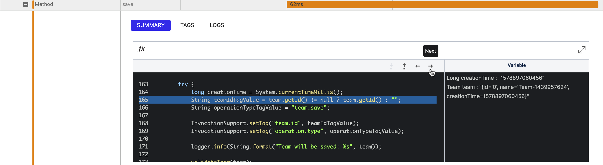
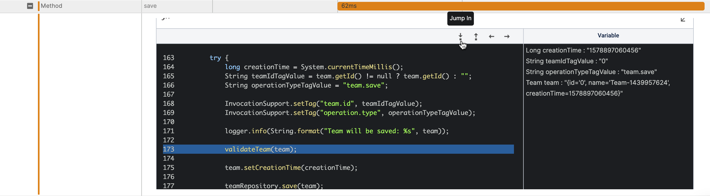

# Trace Chart Tab

In the Trace Chart tab, all your trace data is illustrated with spans. Each span in the Trace Chart represents an interaction of a specific invocation with external services. These spans are displayed when you instrument your functions, and additionally, custom spans that you create can be monitored in the span list.

You can visit the instrumentation section of your desired runtime to learn how to configure your trace data. It must be noted that by default, all your external services will be shown as spans. You can get more insightful information regarding how to [use spans in the best practices section of Thundra docs](doc:doc:best-practices-instrumentation).

Trace Chart consists of 3 main sections:

* [Main Trace](trace-chart-tab.md#main-trace)
* [Span Details](trace-chart-tab.md#span-details)
* [Span List](trace-chart-tab.md#span-list)

To display the Trace Chart, first navigate to the [Functions List ](../functions-list-page/)page and select any function. Then select one invocation from the [Invocation Tab](../function-details-page/invocation-tab.md) on [Function Details](../function-details-page/) page in order to display [Invocation Details](./) page. You can select the Trace Chart tab on the Invocation Details page.

.png>)

### Main Trace

The first and parent span of the Lambda function is named as the Main Trace. It encompasses all of the following spans in the [Span List](https://docs.thundra.io/docs/trace-chart-tab#section-span-list), which means you can interact with it just as you would with child spans in the console. It provides vital information, such as the total duration of your Lambda function, along with various information that you can read more about in detail by visiting the Trace Support section of the runtime of your choice within the Thundra docs.

### Span List

The Span List section lists all the spans that are related to trace data. Each span represents an interaction with external resources. You can display details for each span simply by clicking on it. Additionally, some runtimes such as Java allow you to display spans line by line. According to the instrumentation of your function, custom spans can be analyzed from the Span List.

Depending on the structure of your Lambda function, child spans may be generated and you can display them by expanding the parent span or hide them by collapsing the parent span. All parent spans are opened by default for easy use.

Therefore, it is highly recommended that you visit the Trace Support section of each runtime in the Thundra docs to better understand how to configure your Lambda functions.

### Span Details

When you click on a specific span in the Span List, the details of the span are displayed. All the related information of a specific span is displayed in three tabs:

.png>)

#### Summary

This tab gives you the overall information about the span, including request and response data. Additionally, more information is included in the summary section of an operation, such as whether an error occurred or not, the error message, and the duration of the selected span.&#x20;

.png>)

Moreover, if you set configurations for your function and enable the offline debugging feature, this section gives you another opportunity to dive into your function.

**Offline Debugging**

For any configured method span, the offline debugging view appears in the Summary tab. You can easily debug your function using the event data of a specific invocation. Using the embedded IDE view of Thundra, you can traverse each line of code after the execution. While traversing lines, you can track local variables and values on the right-hand side of the panel. Offline debugging gives you information about what happened in a method for a specific invocation and how values are changed during a transaction. Using the IDE view, you can go to either the previous or next lines of your code and jump in or out of another span.

The Jump In action works for all resources. If you want to dive into a DynamoDB operation in a method, just jump into it; you can go back to your method using the Jump Out action on DynamoDB span.

.png>)

Don't worry if you forget to configure offline debugging for a method: you can still see its input and return parameters. To take advantage of offline debugging, you can easily configure your Lambda function as detailed [here](../../debugging/offline-debugging.md).

#### Tags

The Tags tab shows specific information passed with the span, and can even include custom tags if you have configured them.

.png>)

#### Logs

The Logs tab displays all the logs that occur within the specific part of the Lambda function represented in the span.

.png>)
