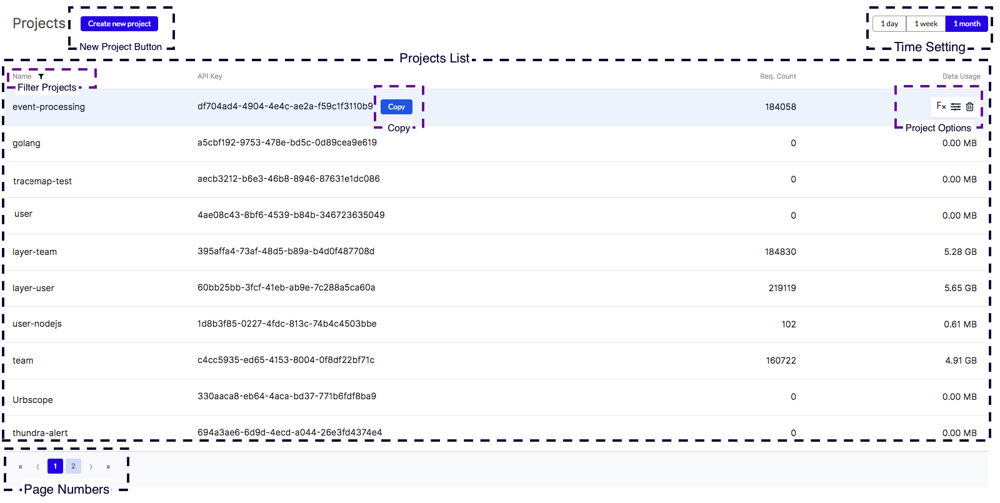

# Projects Page

The Projects page lists all of your Thundra projects that your Lambda functions are associated with. To access this page, simply click on the Profile icon in the navigation bar then select Projects.

Thundra Projects allow you to organize your Lambda functions within the same project, so long as you provide the same API key to those functions. Therefore, one thing to consider is the overall limit of requests you are allowed according to your Thundra subscription. When you create new projects, the default case is that limits are distributed equally amongst all the projects available. However, you may assign available limits across your projects depending on your needs. This can be done by clicking on a project displayed in the Projects List view, which redirects you to the [Project Details](project-details.md) page.

The Projects page consists of the following components :

* New Project Button
* Projects List
* Project Options
* Copy API Key
* Time Setting
* Filter Projects

### New Project Button

The New Project Button allows you to create new projects to connect with your Lambda functions. When you select this option, the New Project view opens up and allows you to enter your project name and a project description. Clicking on the “Create” button will generate an API key and list the project in the [Project List](./#projects-list) view.

.png>)

### Projects List

The Projects List view allows you to see all your Thundra Projects along with their API key and the Request Count, which indicates how active each project is. You can also see data usage listed here, which gives you an overall indication of how data-intensive the Lambda functions connected to the specific project are. Clicking on a listed project redirects you to the [Project Details](project-details.md) page, showing all the details of the specific project.

### Project Options

Each project listing has Project Options, which allow you to edit, delete, and view all related Lambda functions. These options are found on the right side of each Thundra Project listed in the [Project List](./#projects-list) view when you hover on.

.png>)

As shown in the illustration of the Project Options above, there are three options you can select:

* Filter Functions - Redirects you to the Functions List page, listing only the Lambda functions associated with the project.
* Edit Project - Allows you to change the project name and the project description.
* Delete - Allows you to delete a project completely from your Thundra account. Any Lambda functions still associated with the deleted project will result in an authentication error if invoked.

### Copy API Key

Each project has an API Key that is created at the same time you create a project in Thundra. You can copy this API Key to use it. When you hover your mouse over a project listed in the Projects List view, click on the copy button. After copying the API Key, you can set it to the Thundra API Key `thundra_apiKey` environment variable to integrate your Lambda function.

### Time Setting

Time Setting allows you to filter your projects that are created within the selected time interval. You can select the following time intervals:

* 1 day
* 1 week
* 1 month

### Managing Projects

Your Thundra account has a set limit of requests depending on your subscription plan. When you create a new project using the [New Project Button](./#new-project-button) on the [Projects](./) page, the new project has no limit in terms of requests except for the upper global limit.

You can set limits to your Thundra Project by clicking on its name in the [Projects List](./#projects-list) view. This will redirect you to the [Project Details](project-details.md) page of the specific Thundra Project. Next, using the [Limit Control](project-details.md#limit-control) option, you may reserve a limit for the project according to your needs. You have the option to set both the Invocation Request Limit per Month and the Data Usage Limit per Month.

When you delete a Thundra Project, all Lambda functions associated with the project via the project’s API Key will result in an authentication error when invoked. Be careful to associate the Lambda functions to another project, or simply disable Thundra for the Lambda function.


#### Project Management Permissions

People with the `User` role have no access to this page, so it won't appear in the left-hand bar for `Users`.

