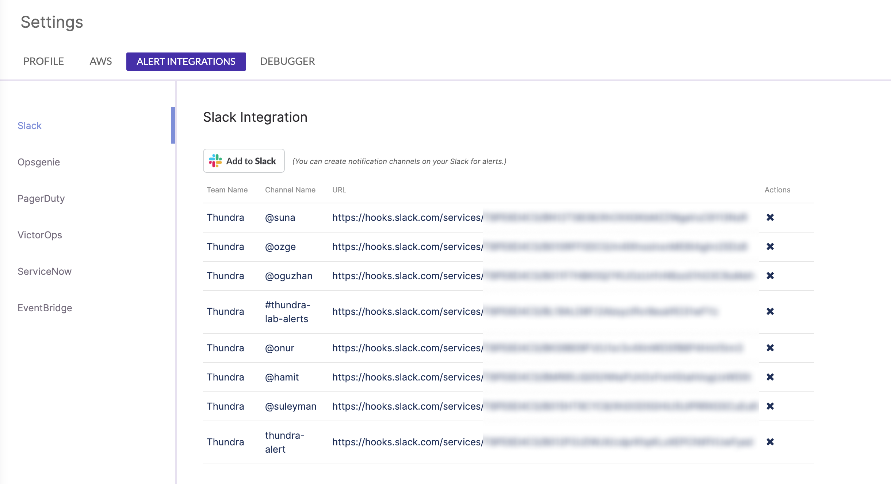

# Slack Tab

To be notified of alerts via your Slack workspace, you can add our Slack application. To configure Slack integration, go to the Settings page, click on the "[Add to Slack](https://api.slack.com/docs/slack-button)" button, sign in to your workspace, and then select the channel that will receive Thundra alert notifications.

You can navigate to the Slack Settings page by opening the Settings page from the left-hand side bar, clicking the User icon, going to the Alert Integrations tab, and then opening the Slack tab.

The Thundra Slack app will request that you confirm your Slack identity in order to send notifications to the channels that you select during the installation process.

The Thundra Slack app can :

* Confirm a user’s identity
* Post to specific channels in your Slack workspace
* Post messages to a channel and direct message conversations

.png>)

After you add the Thundra app to your Slack workspace, the Slack channels you added will be listed when you create alert policies. You may also delete the channels that you add so that they will not be listed when you create alert policies.

.png>)


If a Slack channel is used by an alert policy, you cannot delete this channel unless you have removed it from corresponding alert policies.


After you configure your alert policy with Slack channels, messages will drop into your Slack channel when there is a violation of your alert policy. The link on the message header will take you to the Thundra Console application, which gives more detail about the alert event. Here is an example message:

.png>)
