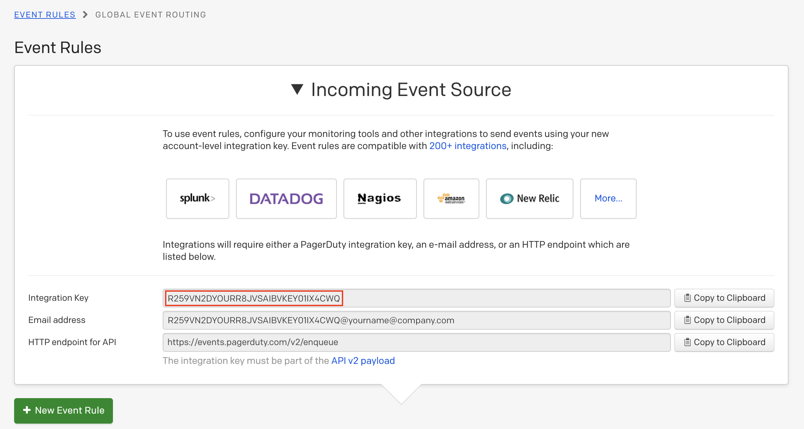

# PagerDuty + Thundra Integration Benefits

## **Benefits of the PagerDuty Integration**

* Notifies on-call developers or operations team members when any issue occurs that is detected by Thundra with the modern application with containers and serverless.
* Provides insights about how to solve the issue thanks to Thundra's actionable alerts.
* Offers the ability to create alerts with several priority levels and increase the level of urgency according to the assigned priority level.

## How it Works

Thundra creates alert events when a condition in an alert policy is met. These alert events will then trigger a new incident on the corresponding PagerDuty Service that has been integrated with Thundra.

## Requirements

PagerDuty integrations require an [Admin base role](https://support.pagerduty.com/docs/user-roles) or account authorization. If you do not have this role, you will need to reach out to an Admin or Account Owner within your organization to configure the integration.

## Support

If you need any help to complete an integration, you can connect with us at support@thundra.io.

## Integration Walkthrough

### In PagerDuty

There are two ways to integrate Thundra with PagerDuty: through Global Event Routing or on a PagerDuty Service. If you are adding this integration to an existing PagerDuty Service, skip to the “Integrating with a PagerDuty Service” section of this guide.

**Integrating With Global Event Routing**&#x20;

This integration method enables you to route events to specific services based on the event’s payload from your tool. If you would like to learn more, read our article on [Global Event Routing](https://developer.pagerduty.com/docs/rest-api-v2/global-event-rules-api/).

1\. From the Configuration menu, select Event Rules.&#x20;

2\. On the Event Rules screen, click on the arrow next to Incoming Event Source to display the Integration Key information. Copy your Integration Key. This is the same Integration Key you will use for any other tool you would like to integrate using event rules. When you have finished setting up the integration in Thundra, you will return to this interface to specify how to route events from Thundra to services in PagerDuty.

#### Integrating With a PagerDuty Service

1. There are two ways to add an integration to a service:
   * **If you are adding your integration to an existing service:** Click the name of the service you want to add the integration to. Then, select the Integrations tab and click the **New Integration** button.
   * **If you are creating a new service for your integration:** Please read our documentation in the "[Configuring Services and Integrations](https://support.pagerduty.com/docs/services-and-integrations#section-configuring-services-and-integrations)" section and follow the steps outlined in the "[Create a New Service](https://support.pagerduty.com/docs/services-and-integrations#section-create-a-new-service)" section, selecting Thundra as the Integration Type in step 4. Continue with the “**In Thundra**” section (below) once you have finished these steps.
2. Enter an Integration Name in the following format: monitoring-tool-service-name (e.g., Thundra-Shopping-Cart), and then select Thundra from the Integration Type menu.
3. Click the Add Integration button to save your new integration. You will be redirected to the Integrations tab for your service.
4. An Integration Key will be generated on the Integrations tab. Keep this key saved, as you will need it when you configure the integration with Thundra in the next section.

 (1).png>)

### In Thundra

1. In your Thundra account, navigate to the [PagerDuty settings on the Thundra console](https://console.thundra.io/settings/pagerduty).
2. Copy and paste your integration key and click the “Save” button.
3. Use PagerDuty as your method of notification when [creating an alert](../../../alerts-page/creating-editing-alert-policies.md).

## How to Uninstall

To stop Thundra from creating alerts in PagerDuty, you need to remove the integration from your alert policies in Thundra.

1. If you have any alert policies using this integration, navigate to the [Policies Tab](https://docs.thundra.io/thundra-web-console/alerts-page/policies-tab). Click the “Edit” button in the Actions section of the alert policy with the PagerDuty integration. When the next window opens, click the “Remove” button in the Notification section.
2. Navigate to the [PagerDuty settings at Thundra console](https://console.thundra.io/settings/pagerduty) and click “Remove” to delete your integration key.

